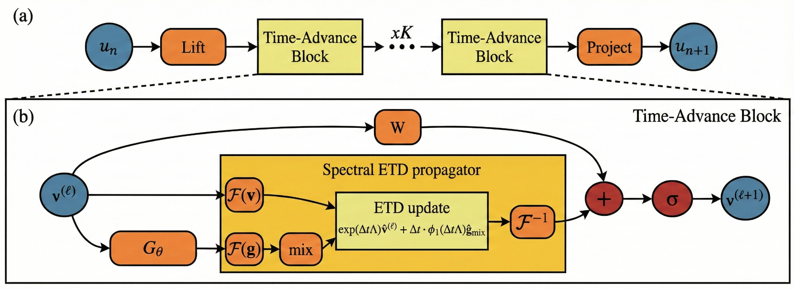

# SGNO



This repository provides a PyTorch reference implementation of the Spectral Generator Neural Operator (SGNO) for one step supervised training and long horizon autoregressive rollouts of PDE dynamics.

SGNO maps a short history u_n to u_{n+1} by lifting inputs to a latent feature field, applying a stack of time advance blocks, and projecting back to the physical channels. Each time advance block performs a spectral exponential time differencing update with a learned diagonal generator and a phi1 weighted forcing term with per frequency channel mixing. Optional spectral truncation or smooth masking can be applied on the forcing pathway to suppress high frequency feedback.

## Repository structure

src/sgno contains the model definitions and a thin wrapper that constructs grids internally and returns a residual update.
scripts contains minimal entry points for sanity checking, training, and rollout evaluation.
configs provides example configurations for 1D, 2D, and 3D regimes.
assets contains figures used by this README.
tests contains a small forward pass test.

## Installation

Python 3.10 or newer is recommended.

Install dependencies:

```bash
pip install -r requirements.txt
```

Editable install:

```bash
pip install -e .
```

Optional developer dependencies:

```bash
pip install -r requirements_dev.txt
```

## Quick sanity check

```bash
python scripts/sanity_check.py
```

## Data format

Training and evaluation scripts expect a NumPy NPZ file containing trajectories as float32 arrays.

Accepted keys:

train and test
u and optionally test

Layouts:

1D: (N, T, C, X)
2D: (N, T, C, X, Y)
3D: (N, T, C, X, Y, Z)

The history length is initial_step. For each training sample, the model consumes u[t:t+initial_step] and predicts u[t+initial_step] with a residual update.

## Reference configurations

The example configs mirror the default dimensional settings used in the paper level experiments.

configs/example_1d.json uses width 28, modes 28, n_blocks 4.
configs/example_2d.json uses width 20, modes 8 per axis, n_blocks 4 with a smooth forcing mask.
configs/example_3d.json uses width 4, modes 8 per axis, n_blocks 4 with inner_steps 5.

## Training

One step supervised training minimizes MSE on the next state.

```bash
python scripts/train_npz.py --config configs/example_2d.json --data path/to/data.npz --out runs/example_2d
```

The output directory contains best.pt and a small state.json.

## Evaluation and paper metrics

Autoregressive rollouts initialize from the first test frames and repeatedly apply the learned one step map. The evaluation script reports rollout metrics aligned with the paper.

Per step normalized RMSE:

nRMSE(t) = ||u_hat(t) - u(t)||_2 / (||u(t)||_2 + eps)

GMean100 for a trajectory is the geometric mean of capped errors over the rollout horizon:

GMean100 = exp( mean_t log( min(nRMSE(t), 100) + eps ) )

Stable step with threshold tau is the first t where nRMSE(t) > tau. Non finite values are treated as crossing at their first occurrence. If the threshold is never crossed, stable step is set to the rollout horizon.

```bash
python scripts/eval_npz.py --config configs/example_2d.json --data path/to/data.npz --ckpt runs/example_2d/best.pt --out runs/example_2d/eval.json --steps 200 --tau 0.1
```

The JSON output includes per trajectory GMean100 and stable step together with summary statistics.

## Build API

```python
from sgno import build_sgno_from_config

model = build_sgno_from_config(
    network_config='sgno;width=20;modes=8;n_blocks=4;initial_step=1;dt=1.0;inner_steps=1;use_beta=false;filter_type=smooth;filter_strength=1.0;filter_order=8;padding=2;alpha_w=1.0;alpha_g=1.0',
    num_spatial_dims=2,
    num_points=64,
    num_channels=1,
)
```

## License

MIT
